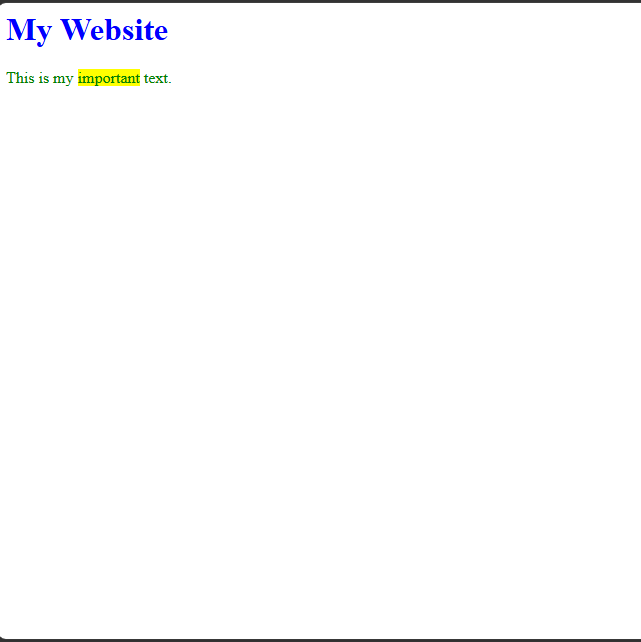

# Day 01 - CSS Selectors and Inline Styling

## Overview

Learned about CSS selectors and styling methods by applying different styles using tag, class, ID, and inline CSS.

## Topics Covered

- CSS Selectors
- Tag Selector
- Class Selector
- ID Selector
- Inline CSS
- Color and Background Color

## Technologies Used

- HTML5
- CSS3

## Practice

Created a simple webpage to practice CSS selectors and applied inline styling along with class and ID based styling.

## Output

