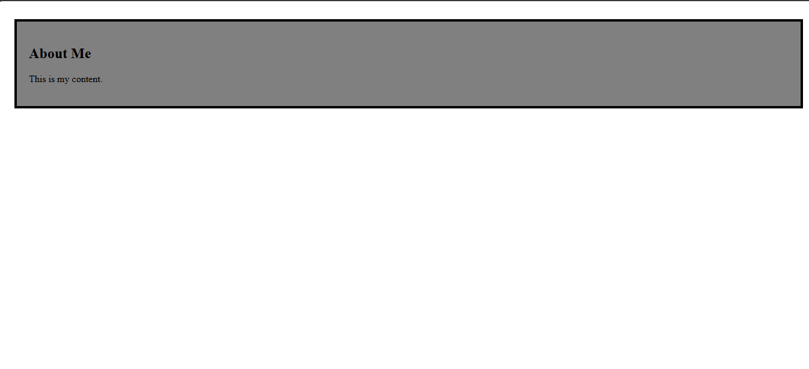

Day 02 - CSS Box Model

Overview

Learned about the CSS Box Model and practiced styling a box using padding, border, margin, and background properties.

Topics Covered

- CSS Box Model
- Padding
- Border
- Background Color
- Margin Shorthand

Technologies Used

- HTML5
- CSS3

Practice

Created a box using div and applied padding, border, background color, and margin shorthand to understand the box model.

Output

