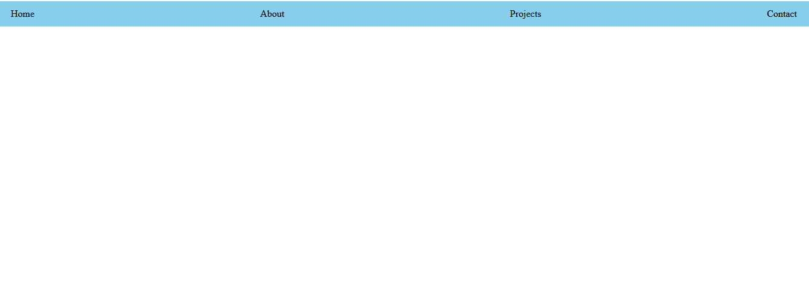

# Day 05 - CSS Flexbox Navbar

## Overview

Created a simple navigation bar using CSS and learned about flexbox layout for aligning navigation links.

## Topics Covered

- CSS Styling for Body
- Margin and Font Family
- Navigation Bar Styling
- Flexbox
- Justify Content and Space Between
- Text Decoration and Font Weight

## Technologies Used

- HTML5
- CSS3

## Practice

Created a navigation bar with links and used flexbox properties to align items and styled the navbar with background color and padding.

## Output

