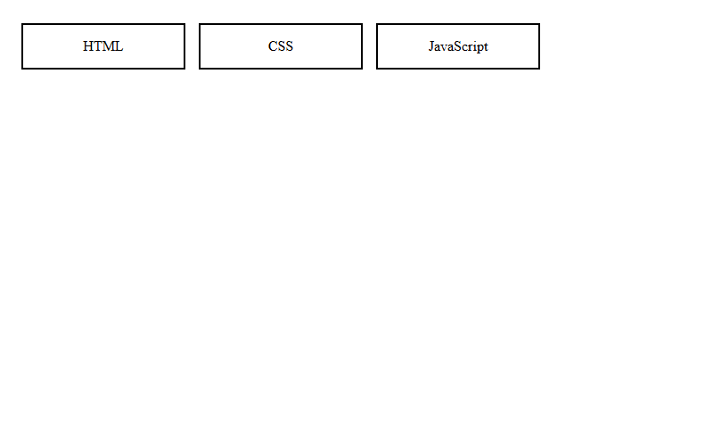

# Day 05 - CSS Flexbox Cards

## Overview

Created a three card layout using CSS flexbox and replicated the given design with HTML, CSS, and JavaScript cards.

## Topics Covered

- CSS Flexbox
- Display Flex
- Gap and Padding
- Border and Width
- Text Alignment

## Technologies Used

- HTML5
- CSS3

## Practice

Built a container with three cards and used flexbox to align them side by side with equal spacing and border styling.

## Output

