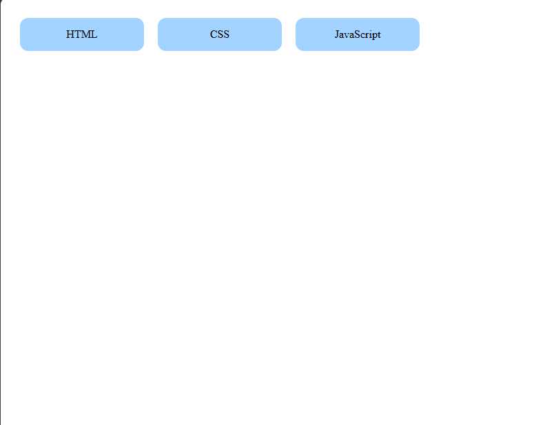

# Day 06 - Skills Section

## Overview

Created a skills section with three skill cards using CSS flexbox and styled them with background color and rounded corners to match the given design.

## Topics Covered

- CSS Flexbox
- Display Flex
- Gap and Padding
- Background Color
- Width and Text Alignment
- Border Radius

## Technologies Used

- HTML5
- CSS3

## Practice

Built a skills container with HTML, CSS, and JavaScript cards and applied flexbox layout, light blue background, and border radius to replicate the target output.

## Output

