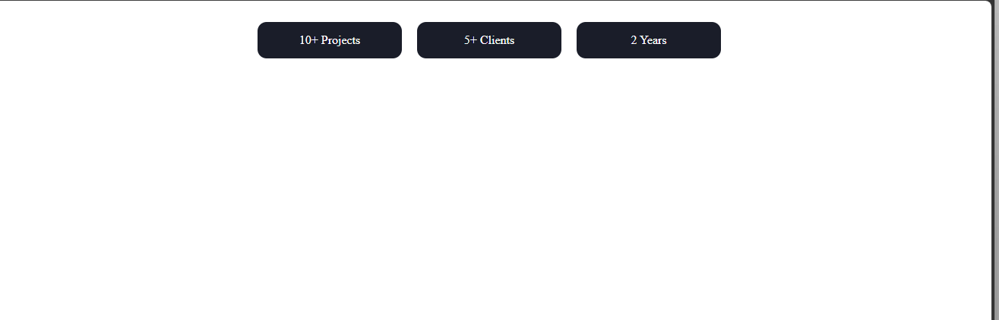

# Day 08 - Stats Section (Cards Layout)

## Overview

Created a responsive stats section with 3 cards showing achievements side-by-side using CSS Flexbox layout, matching the given design with dark cards, rounded corners and hover lift effect.

## Topics Covered

- CSS Flexbox
- display: flex
- Gap and Justify-Content
- Background and Text Styling
- Border Radius
- Hover Effects & Transition
- Transform Property

## Technologies Used

- HTML5
- CSS3

## Practice

Built a stats container using `display: flex` with `gap: 20px` and `justify-content: center`, created 3 stat cards with `width: 150px`, `background-color: #1A1D29`, `color: white`, added `border-radius: 12px`, `padding: 15px 20px` and `transition: all 0.3s ease`. Added hover effect with `transform: translateY(-5px)` and background color change to replicate the target output.

## Output

