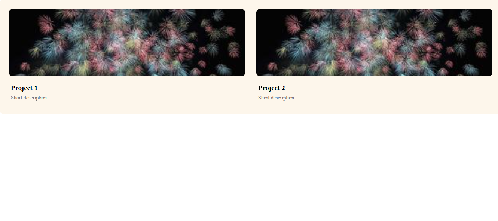

# Day 09 - Project Cards (Grid Layout)

## Overview

Created a responsive project showcase section with two project cards side-by-side using CSS Grid layout, matching the given design with rounded image corners and light background container.

## Topics Covered

- CSS Grid
- display: grid
- grid-template-columns
- Gap and Padding
- Border Radius
- Object Fit
- Image Styling
- Margin Bottom

## Technologies Used

- HTML5
- CSS3

## Practice

Built a projects container using `display: grid` with `grid-template-columns: 1fr 1fr` for two equal columns, added `gap: 30px`, `padding: 25px`, and `background-color: #fdf6eb` with rounded corners. Styled the project cards with full width images using `object-fit: cover`, `border-radius: 10px`, and added content styling with `margin-bottom` for headings to replicate the target output.

## Output

