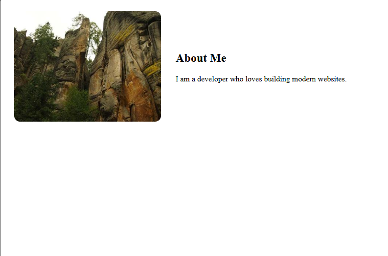

# Day 07 - About Section (Grid Layout)

## Overview

Created a responsive About Me section with an image and text side-by-side using CSS Grid layout, matching the given design with rounded image corners and centered alignment.

## Topics Covered

- CSS Grid
- grid-template-columns
- Gap and Alignment
- Image Styling
- Border Radius
- Text Alignment

## Technologies Used

- HTML5
- CSS3

## Practice

Built an about container using display grid with two columns (300px for image and 1fr for text), added gap, center alignment, and styled the image with full width and rounded corners to replicate the target output.

## Output

