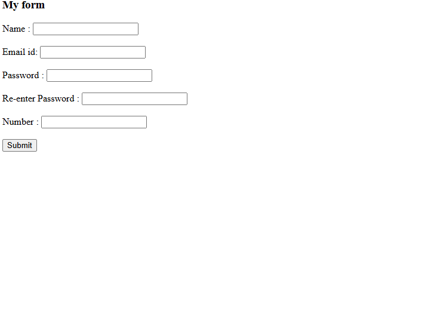

# Day 05 - Hajex Training

## Overview

Created a simple user registration form using HTML to collect basic user details.

## Topics Covered

- HTML Document Structure
- Form Tag and Attributes
- Input Types - text, password
- Form Submission Method
- Labels and Line Breaks

## Technologies Used

- HTML5

## Practice

Created a My Form with name, email id, password, re-enter password and number fields using form and input tags.

## Output

