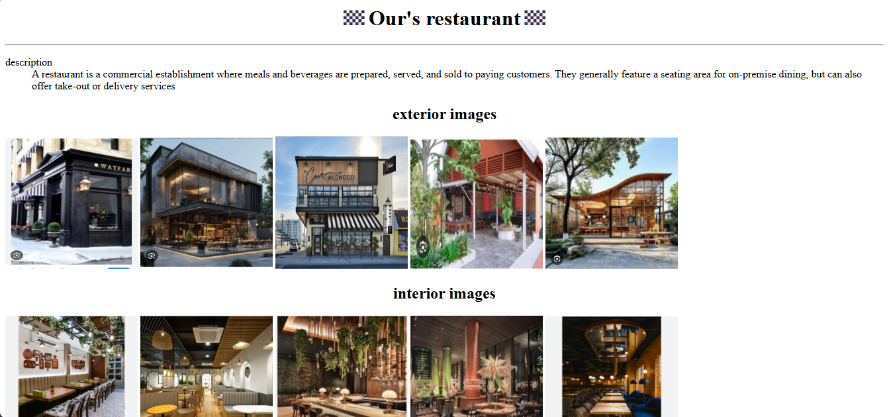
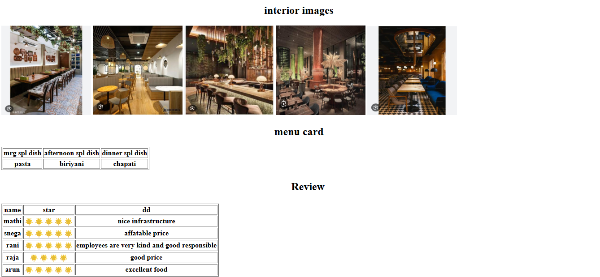

# Day 06 - webpage

## Overview

Created a restaurant website named Our's Restaurant showcasing description, exterior and interior images, menu card and customer reviews using basic HTML tags.

## Topics Covered

- HTML Document Structure
- Headings and Center Alignment
- Description List - dl, dt, dd
- Image Tag with Width and Height
- Table Tag with Border
- Unordered List
- HTML Entities and Emojis

## Technologies Used

- HTML5

## Practice

Built a restaurant webpage with exterior and interior image galleries, a menu card table with morning, afternoon and dinner specials, and a review table with star ratings.

## Output

 
