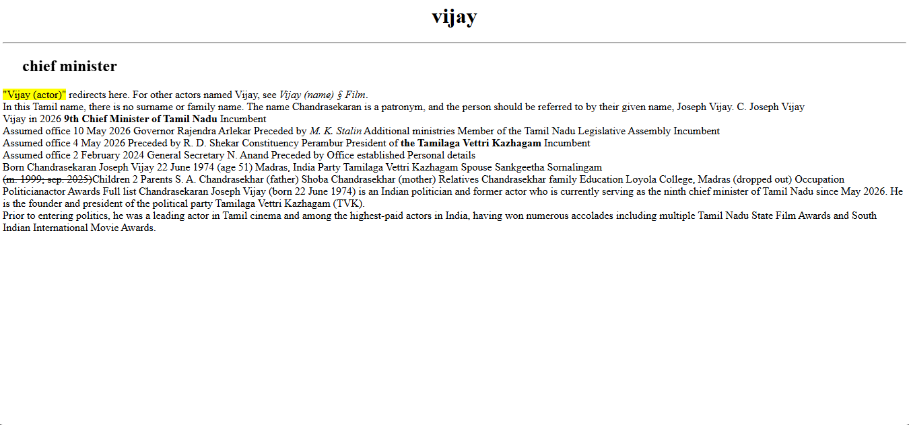

# Day 02 - Webpage

## Overview

Started learning HTML fundamentals and created my first simple webpage about Vijay by understanding the basic structure of a webpage.

## Topics Covered

- HTML Document Structure
- Basic HTML Elements
- Headings and Paragraphs
- Text Formatting Tags
- Marquee and Horizontal Rule

## Technologies Used

- HTML5

## Practice

Created a simple webpage using HTML elements and practiced building the basic layout of a webpage.

## Output

