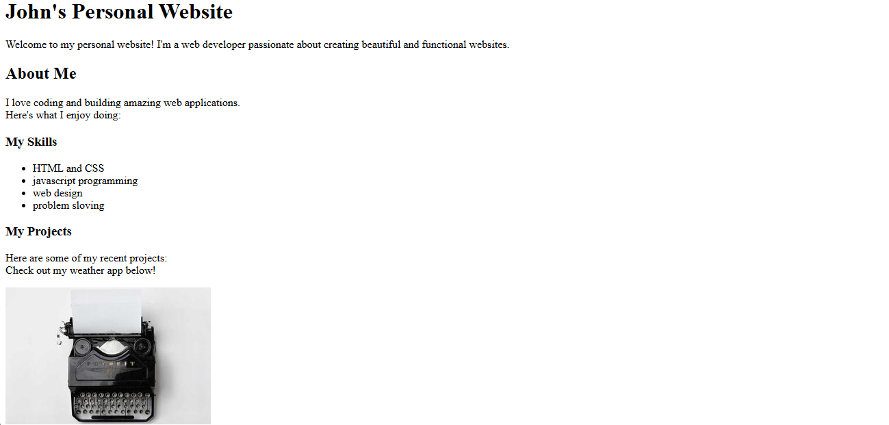
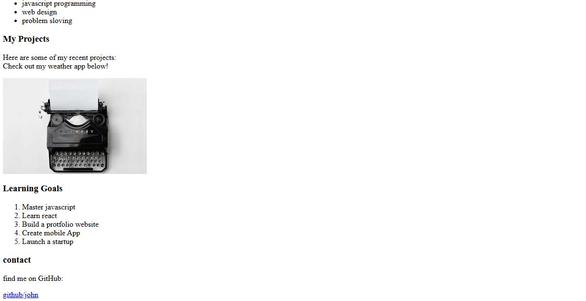

# Day 08 - Personal Website - John Portfolio

## Overview
Built John's personal website using HTML. It includes introduction, skills, projects with image, learning goals and contact link. Used semantic tags to make it proper structure.

## Topics Covered
- Semantic HTML5 Tags (header, main, section, footer)
- Headings (h1, h2, h3)
- Lists (ul, ol, li)
- Paragraph, Line Break (br)
- Image Tag and Alt Attribute
- Anchor Tag with target blank

## Technologies Used
- HTML5

## Practice
Created a single page portfolio for John with About Me, My Skills list, My Projects section with weather app image, Learning Goals in ordered list, and GitHub contact link.

## Output
 

