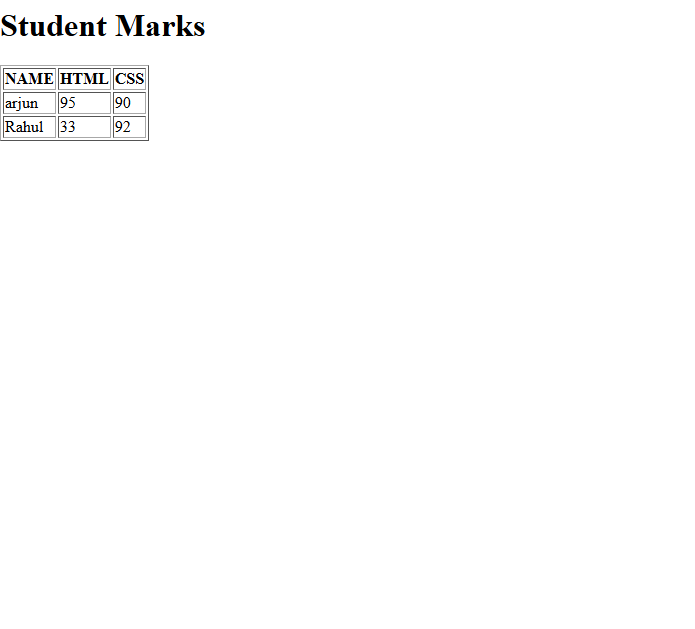

# Level 05 - Student Marks Table

## Overview
Created a student marks table using HTML table tag. 

## Features
- Used `<table>`, `<tr>`, `<th>`, `<td>` tags
- Used `border="1"` attribute to show table borders
- Displays NAME, HTML, CSS marks

## Topics Covered
- HTML Tables
- Table Header (th) and Data (td)
- Border Attribute

## Code
File: `index.html`

## Output

 
