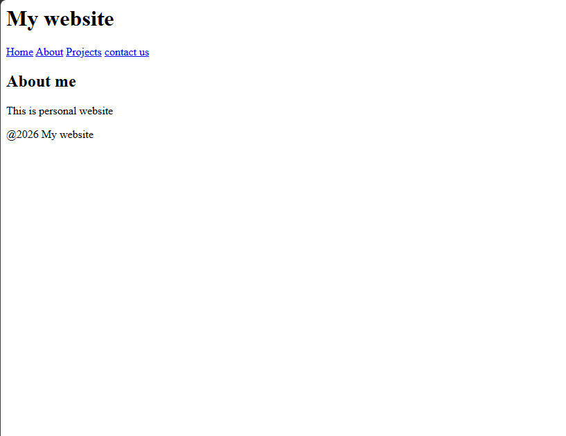

# My Website

## Overview
Simple personal website using HTML5 semantic tags. Made for SkillCosma Level task.

## Features
- Header with website title
- Navbar - Home, About, Projects, Contact
- About me section
- Footer with copyright

## Code
File: index.html

## Tags Used
- `<header>` `<nav>` `<main>` `<section>` `<footer>`

## Output

